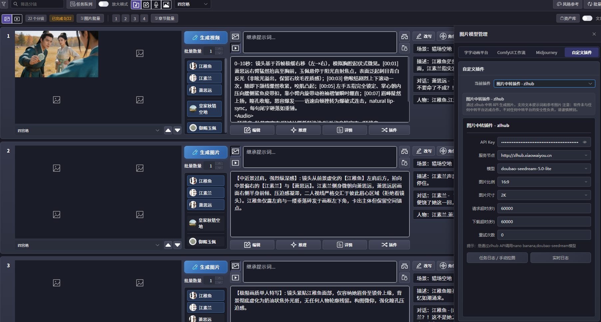

# zz-image-plugins

## 仓库描述

`zz-image-plugins` 是一个用于图像生成中转服务的插件仓库，包含多个渠道与版本的实现（`zlhub`、`tduhub`、`webai`、`V2` 变体），以及一个带任务日志和实时日志能力的增强版本 `nano_banana_plugin_geeknow`。



## 项目结构

```text
zz-image-plugins/
├─ docs/
│  ├─ images/                       # 文档图片资源
│  └─ require/                      # 接口说明文档
├─ image_plugin_zlhub_nano_banana/  # zlhub 版本
├─ image_plugin_zlhub_nano_banana-V2/
├─ image_plugin_tduub_nano_banana/  # tduhub 版本
├─ image_plugin_tduhub_nano_banana-V2/
└─ nano_banana_plugin_geeknow/      # 增强版本（日志、手动下载、更新能力）
```

## 功能概览

- 文生图 / 图生图请求封装（通过中转 API）。
- 多提供方路由（按模型前缀或配置路由）。
- 生成任务落库（SQLite）和任务状态追踪。
- 失败任务手动下载与重试（增强版）。
- 实时日志查看页面（增强版）。
- 插件 UI 配置页（API Key、Base URL、模型、尺寸、超时等）。

## 环境要求

- Python 3.11+（推荐 3.12）。
- 依赖库：
  - `requests`
  - `Pillow`
- 可访问的中转 API 服务地址与有效密钥。

## 快速开始

1. 选择一个插件目录（例如 `nano_banana_plugin_geeknow/`）。
2. 将该目录按宿主应用插件规范放入插件路径。
3. 在插件 UI 中填写：
   - `api_key`
   - `base_url`
   - `model`
   - 可选参数（`aspect_ratio`、`image_size`、`request_timeout` 等）
4. 保存配置后执行一次生成，确认输出目录中已生成图片文件。

## 关键目录说明（增强版）

- `nano_banana_plugin_geeknow/main.py`：插件主逻辑（`get_info` / `generate` / `handle_action`）。
- `nano_banana_plugin_geeknow/ui/index.html`：插件配置页。
- `nano_banana_plugin_geeknow/ui/task_log.html`：任务日志页。
- `nano_banana_plugin_geeknow/ui/live_log.html`：实时日志页。
- `nano_banana_plugin_geeknow/image_task_logs.db`：SQLite 任务日志数据库。
- `nano_banana_plugin_geeknow/manual_downloads/`：手动下载图片保存目录。

## 配置建议

- `request_timeout` 建议按网络情况设置为 60-180 秒。
- `retry_count` 建议与上游服务能力匹配（部分实现中该字段未完全接入重试逻辑）。
- 生产使用时建议固定可信 `base_url`，避免误配导致请求失败。

## 安全与合规提示

- 不要在仓库中提交真实密钥（API Key、Access Key、Token）。
- 推送前建议执行密钥扫描，避免触发 GitHub Push Protection。
- 如密钥已泄露，请立刻在服务提供方后台进行轮换/禁用。

## 开发与维护

1. 新增渠道时，可在 `main.py` 中增加 `send_<provider>_request` 适配方法。
2. 在 `generate()` 中补充路由规则与参数映射。
3. 如有 UI 参数新增，请同步修改 `ui/index.html` 与运行时读取逻辑。

## 参考文档

- [zlhub-chat-image-api](docs/require/zlhub-chat-image-api.md)
